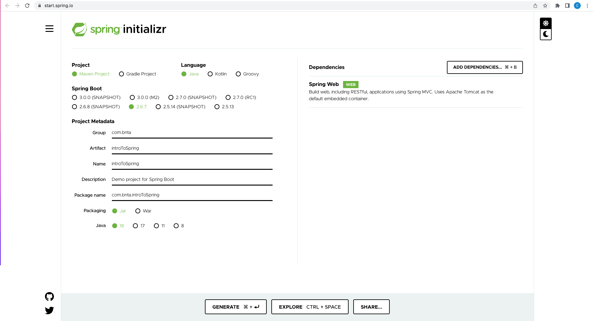
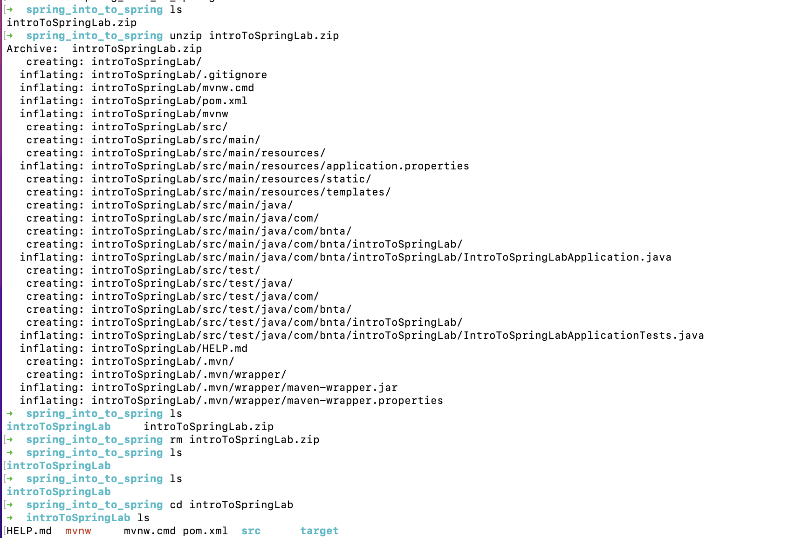
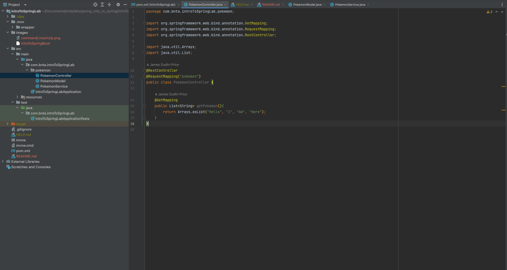
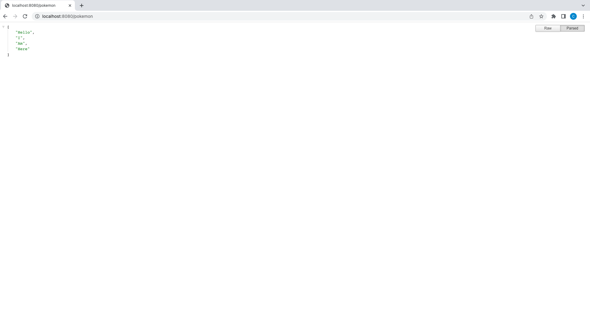

# Intro To Spring Boot

### 1. Initialising a spring project

- Head over to the https://start.spring.io/ website and create spring project, enter the
relevant information and correct dependencies for your project as shown above
- Hit the generate button
- Next a zip file will be generated 
- Move it in to wherever your project will be appropriate place you can do this using the command line
- For example `mv introToSpring.zip /Users/yourUser/Documents/MyFirstSpringProject`
- You can then `cd` into the folder and unzip the zip like this `unzip introToSpring.zip`
  

### 2. Add a controller class with the correct annotations

### 3. Try out what you have just made!!!

- Type (http://)localhost(yourportnumber)/whatYouSpecifiedInTheMappingRequest
- And here is the result, an array of strings on a specified route has been outputted

